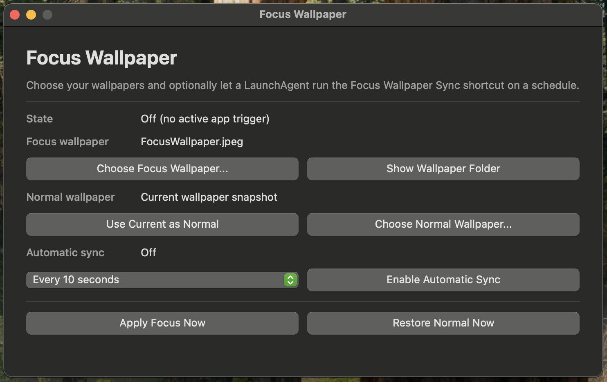
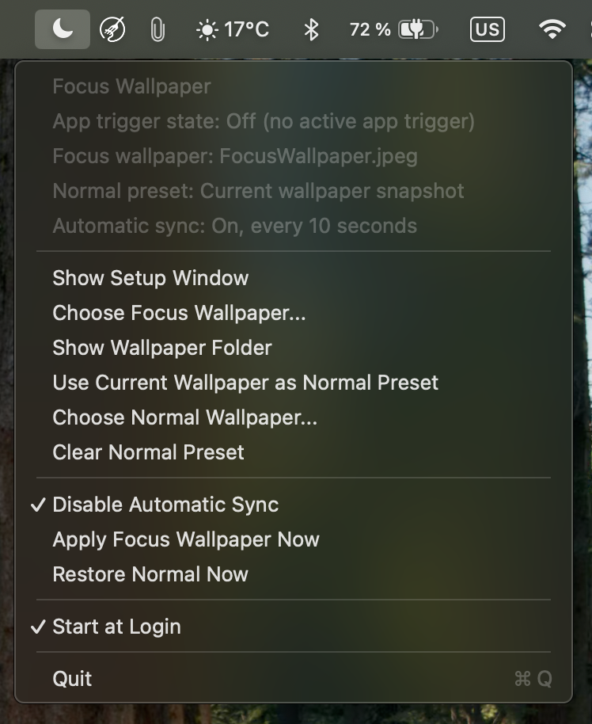
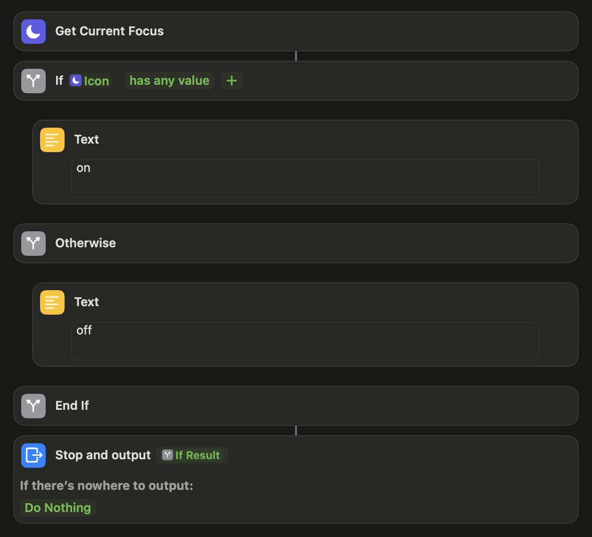

# Focus Wallpaper

Focus Wallpaper is a macOS menu bar app that changes your desktop wallpaper when Focus is active and restores your normal wallpaper when Focus ends.

Direct Focus automations can trigger the app with URL actions, so they do not need to point to a fixed app file path. Automatic Sync uses one polling shortcut that returns `on` or `off` to a background helper.

## Build

```sh
chmod +x scripts/package_app.sh
scripts/package_app.sh
```

The app bundle is created at:

```text
dist/FocusWallpaper.app
```

With Xcode installed, you can open `Package.swift` to inspect or build the Swift source. Use `scripts/package_app.sh` for the final app bundle because it adds the app icon, `Info.plist`, and code signature.

## App Setup



1. Open `dist/FocusWallpaper.app`.
2. Choose `Choose Focus Wallpaper...`.
3. Use `Show Wallpaper Folder` if you want to open the folder where Focus Wallpaper stores its copied wallpaper files.
4. Optionally choose `Use Current as Normal` or `Choose Normal Wallpaper...`.
5. Optionally enable `Start at Login` from the menu bar item.

The app stays in the menu bar. If you close the setup window, open it again from the Focus Wallpaper menu bar icon.

If no normal wallpaper is set, the app captures the current wallpaper before applying the Focus wallpaper and restores that captured wallpaper when Focus ends.



## Shortcut Setup

Open Focus Wallpaper once after moving the app so macOS registers its URL scheme.

Create two Shortcuts automations:

- Focus turns on: open `focuswallpaper://on`
- Focus turns off: open `focuswallpaper://off`

These URL triggers keep the shortcut working even if the app is moved.

## Automatic Sync

If you prefer polling with one shortcut, create a shortcut named `Focus Wallpaper Sync`:

```text
Get Current Focus
If Current Focus has any value
    Text on
Otherwise
    Text off
End If
```



Do not use `Open URLs` inside this polling shortcut. The LaunchAgent reads the shortcut output and calls Focus Wallpaper in the background, which avoids stealing keyboard focus while you type.

Then open Focus Wallpaper, choose an Automatic Sync interval, and click `Enable Automatic Sync`.

Automatic Sync is controlled from the app. Disabling it stops and removes the sync LaunchAgent. Quitting Focus Wallpaper also stops the sync LaunchAgent, and the app starts it again the next time Focus Wallpaper opens if Automatic Sync was enabled.
